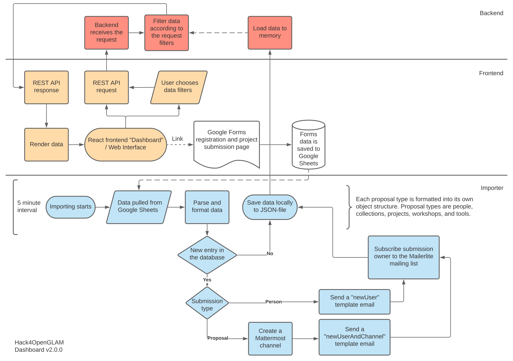

# Hack4OpenGLAM Dashboard

[](https://github.com/AvoinGLAM/h4og-dashboard/actions/workflows/main.yml)

Google Forms data fetching, parsing, and visualizing on public web interface. [Learn more about Hack4OpenGLAM (summit.creativecommons.org)...](https://summit.creativecommons.org/hack4openglam-launch/)

## Table of contents

- [Hack4OpenGLAM Dashboard](#hack4openglam-dashboard)
  - [Components](#components)
  - [Workflow](#workflow)
    - [Data parsing and formatting](#data-parsing-and-formatting)
    - [Automations](#automations)
    - [Frontend App and REST API](#frontend-app-and-rest-api)
  - [Getting Started](#getting-started)
    - [Development](#development)
    - [Configuration](#configuration)
    - [Acquiring Google Spreadsheets API credentials](#acquiring-google-spreadsheets-api-credentials)
    - [Building and Docker](#building-and-docker)
  - [Attributions](#attributions)
  - [Troubleshooting](#troubleshooting)

## Components

The project consists of three main components:
- front-end
- back-end
- importer

Each of these components live in their corresponding directory.

|Component|Overview|
|---|---|
|frontend|[CRA](https://github.com/facebook/create-react-app) frontend app|
|backend|Exposes an REST API for frontend to call. Reads data from importer's output, filters it according to the API request's parameters, and responds it.|
|importer|Imports data from Google Spreadsheets and parses it into clean machine-readable format. [The importer is run in 5 minute intervals](https://github.com/AvoinGLAM/h4og-dashboard/blob/production/importer/src/index.js#L8-L9), which means that the data is refreshed in this interval.|

## Workflow

The following flowchart shows the functions for each component in their order.



### Data parsing and formatting

Parsed and formatted data is saved locally to `data/data.json`. It is an array of objects. Each object is a single data entry.

There can be multiple data entries in a single Google Spreadsheets row. For example, a submission could contain details of a person, but they also may have wanted to submit a project. This is how multiple entries end up in a single row.

Importer will read a single row and seperate the entries of it into the output. This is repeated for all rows of the Spreadsheet.

Most important files for the parsing process are:
- [importer/src/import/parser/rawRow.js](https://github.com/AvoinGLAM/h4og-dashboard/blob/production/importer/src/import/parser/rawRow.js)
    - Maps Google Spreadsheets table column indexes into a named object
    - When creating a new Google Forms, you'll may need to remap the column indexes here
- [importer/src/import/parser/formatData.js](https://github.com/AvoinGLAM/h4og-dashboard/blob/production/importer/src/import/parser/formatData.js)
    - Casts Spreadsheet data from a named object into objects that vary by the entry type. Entry types are:
        - people
        - collections
        - projects
        - workshops
        - tools
    - Data added here will be available through the API, unless a field is opted out

For flags and additional manually or automatically added details, we use a seperate table from Google Forms's table. In this table each row index matches with a row index of the Google Forms's table.

|importedBefore|eventRole|Slug (read-only)|
|---|---|---|
|1| |painting-a-painting|
|2| |alice|
|2| |bob|

When a row is read, the program checks from the other table whether the importedBefore is not empty. If it is empty, it will mark it with a number (1 = imported as a proposal, 2 = imported only as a person) and also save the generated slug. For each new row in the Spreadsheet (importedBefore is empty), there are additional tasks taken. The read-only slug can be used for data analysis purposes in the spreadsheet.

### Automations

Newly imported rows (when importedBefore is empty) run automations. Every submission [adds its creator to the Mailerlite mailing list through their API](https://github.com/AvoinGLAM/h4og-dashboard/blob/production/importer/src/import/mailerlite.js).

If a submission contained a proposal (entry type is not people), [a Mattermost channel will be created through their API](https://github.com/AvoinGLAM/h4og-dashboard/blob/production/importer/src/import/mattermost.js).

User will be also [sent an acknowledgment email](https://github.com/AvoinGLAM/h4og-dashboard/blob/production/importer/src/import/mail.js). The contents will vary, whether a Mattermost channel creation was needed or not (`newUser` / `newUserAndChannel`). If a Mattermost channel was created, the channel link will be added to the email.

### Frontend App and REST API

#### GET `/api/results`
[The frontend app uses the GET `/api/results` API route to fetch data.](https://github.com/AvoinGLAM/h4og-dashboard/blob/production/frontend/src/api.js) 

[Filtering is possible using query parameters:](https://github.com/AvoinGLAM/h4og-dashboard/blob/production/backend/src/routes/api.js#L22-L28)
- `type` - One of these: people, collections, workshops, projects, tools
- `ownerHash` - Email hash of a person. Results will be all entries submitted using this email (=person).
- `slug` - Entry slug

Multiple filters can be combined, but the same query parameter can't be repeated more than once.

#### GET `/*`
The backend also serves the built React frontend at `/` route from the `./web/` directory.

This is why the [`docker-compose.yml`](https://github.com/AvoinGLAM/h4og-dashboard/blob/production/docker-compose.yml) needs to spin up only importer and backend containers.

## Getting Started

### Development

1. Clone the repository
2. Install the dependencies by running `npm install` in the each component directory
3. Each component can be run using `npm start`. Remember to configure the app using the instructions below. You may need to run the components simultaneously, though you can run importer just once, if you're not actively working on the parsing.

Running the frontend development server will normally tell you the port it's listening on. The backend listens on port 80 by default, but it can be changed in `config/backend/config.json`. Make sure that [`baseResultsUrl` constant in the `frontend/src/api.js:1`](https://github.com/AvoinGLAM/h4og-dashboard/blob/production/frontend/src/api.js#L1) points to the correct URL address in order to frontend to communicate with backend.

### Configuration

First, go through `config/` folder and configure all the `*.example.json` files accordingly. You'll need to have your Mattermost API, Mailerlite API, SMTP server details, and Google Spreasheets details on hand.

Create an empty folder in the root named `data/`.

In case you're starting completely from scratch, you'll need your Google Forms submission form and the Spreadsheet linked to it. You can ask AvoinGLAM folks for a template or create a form and rewire it [importer/src/import/parser/rawRow.js](https://github.com/AvoinGLAM/h4og-dashboard/blob/production/importer/src/import/parser/rawRow.js) yourself. 

### Acquiring Google Spreadsheets API credentials

#### Step 1: Set up your Google Project & enable the Sheets API

1. Go to the [Google Developers Console](https://console.developers.google.com/)
2. Select your project or create a new one (and then select it)
3. Enable the Sheets API for your project
4. In the sidebar on the left, select APIs & Services > Library
5. Search for "sheets"
6. Click on "Google Sheets API"
7. click the blue "Enable" button

#### Step 2: Create a service account

1. Follow steps above to set up project and enable sheets API
2. Create a service account for your project
* In the sidebar on the left, select APIs & Services > Credentials
* Click blue "+ CREATE CREDENITALS" and select "Service account" option
* Enter name, description, click "CREATE"
* You can skip permissions, click "CONTINUE"
* Click "+ CREATE KEY" button
* Select the "JSON" key type option
* Click "Create" button
* your JSON key file is generated and downloaded to your machine (it is the only copy!)
* click "DONE"
* note your service account's email address (also available in the JSON key file)
3. **Share the Google Sheet (that is connected to the Forms) with your service account using the email noted above** (important)

#### Step 3: Create the configuration files

1. Move the JSON key file downloaded in the previous step to `config/google-key.json`
2. Create a JSON file `config/config.json`, with the following content:
```json
{
    "spreadsheet": "SPREADSHEET_ID_HERE"
}
```
You can obtain the spreadsheet ID from the URL-address of the spreadsheet, which looks like this: `https://docs.google.com/spreadsheets/d/[SPREADSHEET_ID_IS_HERE]/edit`

### Building and Docker
The GitHub workflow in this repository automatically builds React and Docker on push event to the production branch.

You can reproduce the build steps manually as following.

1. backend
    1. Build React app
        1. `cd frontend`
        2. `npm run build`
    2. Build Docker image
        1. `cd backend`
        2. `docker build -t docker.pkg.github.com/avoinglam/h4og-dashboard/backend .`
2. importer
    1. Build Docker image
        1. `cd importer`
        2. `docker build -t docker.pkg.github.com/avoinglam/h4og-dashboard/importer .`

Finally you can spin up the images using the `docker-compose.yml`.

```
$ docker-compose up
```

## Attributions

#### [/frontend/src/assets/images/frame.png](https://github.com/AvoinGLAM/h4og-dashboard/blob/production/frontend/src/assets/images/frame.png)
Commons user Sailko, CC BY 3.0 <https://creativecommons.org/licenses/by/3.0>, via Wikimedia Commons

#### [/frontend/src/assets/images/frame2.png](https://github.com/AvoinGLAM/h4og-dashboard/blob/production/frontend/src/assets/images/frame2.png)
["Goldener Bilderrahmen - gold picture frame"](https://www.flickr.com/photos/37977505@N00/2303608353) by [eriwst](https://www.flickr.com/photos/37977505@N00) is licensed under [CC BY-SA 2.0](https://creativecommons.org/licenses/by-sa/2.0/?ref=ccsearch&atype=rich)

## Troubleshooting

#### No results are shown in the frontend
Check, that:
- On the networking tab of your browser developer tools: API request from the frontend to the backend is responded to with status code 200 OK
- `data/data.json` is not empty
- Dump backend's data variable to debug the issue

#### `Error: invalid_grant: Invalid JWT: Token must be a short-lived token (60 minutes) and in a reasonable timeframe. Check your iat and exp values in the JWT claim.`
Check if the clock in the Docker container is off. You can re-sync the clock by running the following command:
`docker run --rm --privileged node:lts-alpine hwclock -s`
